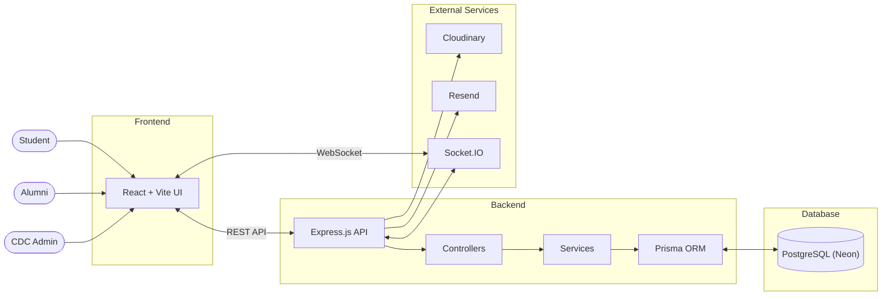
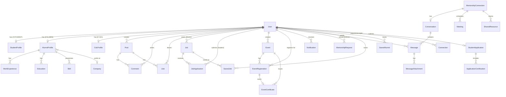
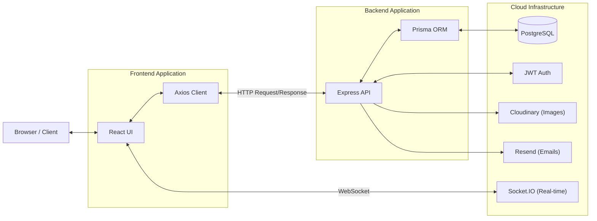
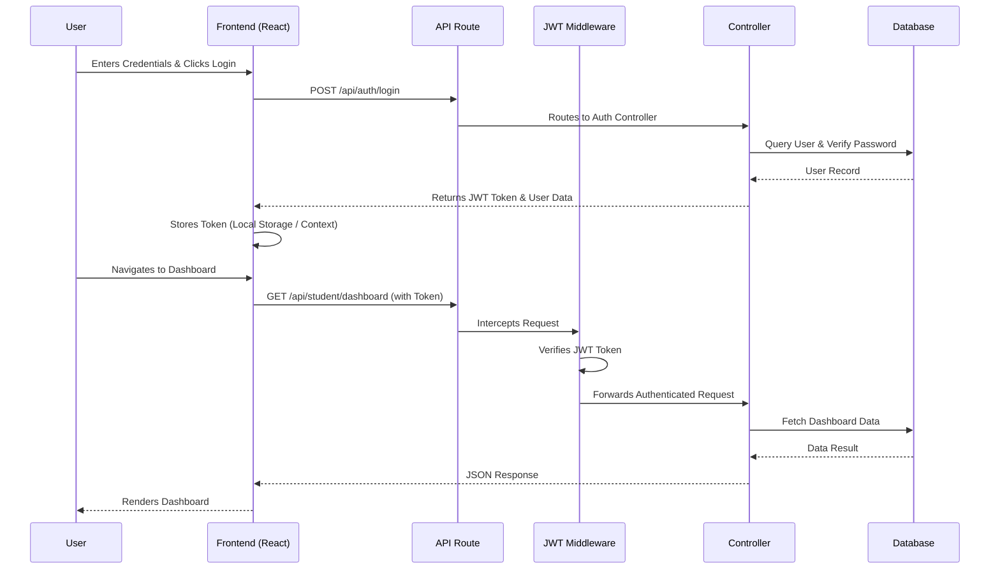
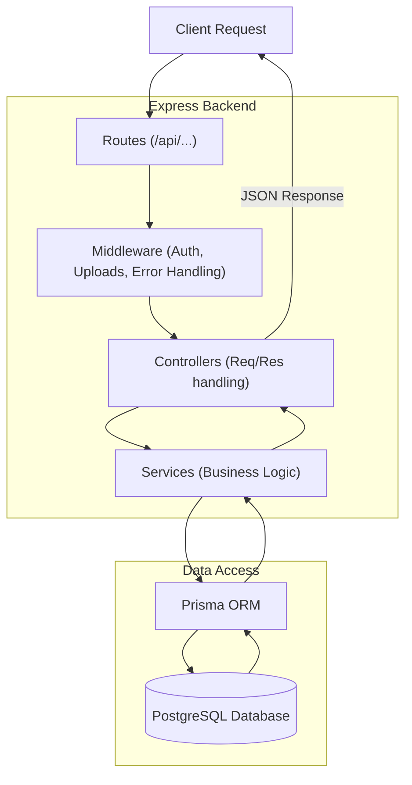
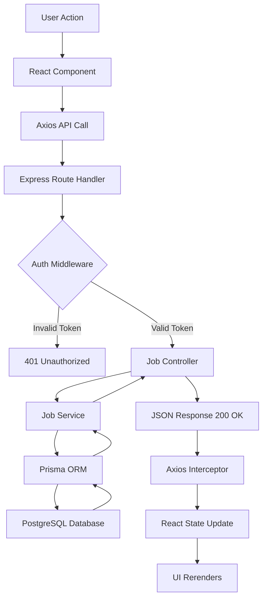
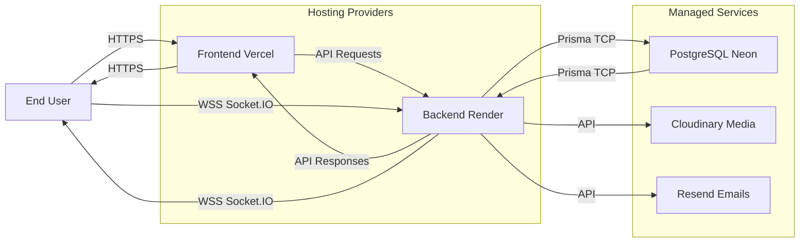
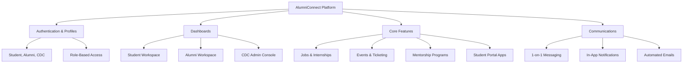

# AlumniConnect Project Report

## 1. Executive Summary

**AlumniConnect** is a comprehensive role-based college networking platform designed to bridge the gap between students, alumni, and the Career Development Cell (CDC). The platform centralizes mentorship, job opportunities, event management, and real-time communication into a single, cohesive workspace.

## 2. Platform Overview

AlumniConnect supports three primary roles, each with tailored functionalities:

### 2.1 Student Features
- Seamless registration and login
- Comprehensive profile management
- Access to an extensive alumni directory for mentorship requests
- Job and internship browsing and application
- Event registration and attendance tracking
- Real-time one-to-one messaging with mentors and peers

### 2.2 Alumni Features
- Professional profile and availability management
- Event creation and management
- Job and internship posting
- Applicant review and status tracking for posted opportunities
- Mentorship request management
- Direct messaging with students

### 2.3 CDC (Career Development Cell) Features
- Secure, login-only access (no open registration)
- Review capabilities for student applications
- Moderation of alumni-created events and job postings
- Official CDC event creation
- Data export capabilities (e.g., event registrants as CSV)

## 3. Technology Stack

The platform leverages a modern, robust, and scalable technology stack:

- **Frontend:** React 19, TypeScript, Vite, Tailwind CSS v4, Redux Toolkit
- **Backend:** Node.js, Express 5, Prisma ORM, PostgreSQL (Neon)
- **Authentication:** Passport.js (Google OAuth 2.0), JWT Authentication, bcryptjs
- **Real-time Communication:** Socket.IO, native WebSocket (`ws`) library
- **File Management:** Multer, Cloudinary
- **Notifications & Email:** Firebase Cloud Messaging (FCM), Nodemailer, Resend
- **Testing:** Vitest, React Testing Library, Jest, Supertest, Cypress

## 4. System Architecture

### 4.1 High-Level System Architecture

The architecture connects users through a React frontend to an Express API backend, utilizing a PostgreSQL database and various external services.

### 4.2 Database Architecture

The data layer uses PostgreSQL, managed via Prisma ORM, utilizing Role-Based Access Control to distinguish between generic users and specific profiles.

### 4.3 Client–Server Architecture

The interaction between the React client and Express server relies on HTTP requests for standard operations and WebSockets for real-time features.

### 4.4 Authentication Flow

### 4.5 MVC Architecture

The backend employs a Model-View-Controller pattern integrated with a Service layer to encapsulate business logic.

### 4.6 Request Lifecycle

### 4.7 Deployment Architecture

The application is deployed across resilient cloud providers ensuring high availability and robust performance.

### 4.8 Feature Architecture

## 5. Security & Real-Time Communication

- **Real-Time System**: Uses a native WebSocket (`ws`) library running on the Express HTTP server instance. Handshakes are authenticated via JWT. Dead connections are detected through a heartbeat mechanism.
- **Security Enhancements**: 
  - Helmet and Express Rate Limit implemented.
  - Optional email verification and password reset functionality is available.
  - Role-based restricted routing on the frontend and backend.
  - Passwords hashed using `bcryptjs`.

## 6. Testing Strategy

The platform maintains a robust test suite covering multiple layers:
- **Frontend Unit/Component**: Vitest and React Testing Library
- **E2E Testing**: Cypress
- **Backend API**: Jest and Supertest
- **Performance**: k6 for load testing

## 7. API Surface Summary

The REST API exposes well-defined endpoints organized into domains:
- `/api/auth/*` - User authentication and registration
- `/api/student/*` - Profile and dashboard access
- `/api/jobs/*` - Job listings, creation, and applications
- `/api/events/*` - Event management and attendance tracking
- `/api/mentorship/*` - Mentorship requests and management
- `/api/messages/*` - Real-time chat history and delivery

## 8. Conclusion

AlumniConnect stands out as a scalable, secure, and modern web application. Through the use of a robust MVC architecture on the backend, a reactive frontend, and comprehensive deployment strategies, it successfully addresses the networking and professional development needs of academic institutions.
