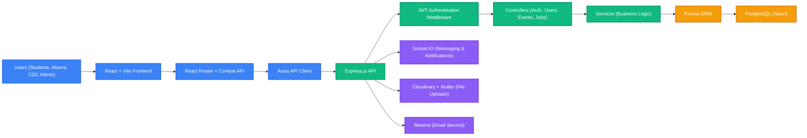

# AlumniConnect

> A role-based college networking platform for students, alumni, and the Career Development Cell (CDC).


## Overview

AlumniConnect brings students, alumni, and CDC together in one workspace for mentorship, jobs, events, announcements, and messaging.

### What the platform supports

- Student and alumni authentication
- CDC login-only access
- Student, alumni, and CDC dashboards
- Job browsing, bookmarking, applications, and moderation
- Event creation, registration, attendance, and approvals
- Mentorship requests and one-to-one messaging
- Real-time online presence updates through Socket.IO
- File uploads with Cloudinary, plus a local fallback
- Optional email verification and password reset flows

## At a Glance

| Area | Details |
| --- | --- |
| Frontend | React 19, TypeScript, Vite, Tailwind CSS v4 |
| Backend | Express 5, Prisma, PostgreSQL |
| Realtime | Socket.IO |
| Forms | React Hook Form + Zod |
| HTTP | Axios |
| File Uploads | Cloudinary or local `uploads/` fallback |
| Dev Ports | Frontend `5173`, Backend `5002` |

## Architecture



### Component Overview

- **Users (Students, Alumni, CDC Admin)**: The primary actors interacting with the portal via tailored dashboards.
- **React + Vite Frontend**: The fast, optimized client-side application built with React 19.
- **React Router + Context API**: Handles client-side navigation and global state management (Authentication).
- **Axios API Client**: Manages asynchronous HTTP requests to the backend with interceptors for auth tokens.
- **Express.js API**: The robust backend framework routing RESTful requests.
- **JWT Authentication Middleware**: Secures endpoints by verifying JSON Web Tokens passed in headers.
- **Controllers**: Directs traffic and parses request/response objects for specific modules (Auth, Events, Jobs, Mentorship).
- **Services**: Encapsulates the core business logic, keeping controllers clean and reusable.
- **Prisma ORM**: Type-safe database client ensuring reliable and structured queries.
- **PostgreSQL (Neon)**: The primary relational database scaling serverless storage.
- **Socket.IO (Messaging & Notifications)**: Enables bidirectional, real-time communication for chats and instant alerts.
- **Cloudinary + Multer**: Handles efficient parsing of multipart forms and secure cloud storage for avatars, resumes, and banners.
- **Resend**: Transmits transactional emails for verification, password resets, and event notifications.

## Role-Based Features

### Student

- Register and log in
- Build and update a profile
- Browse alumni and request mentorship
- Apply for jobs and internships
- Register for events
- View event certificates
- Chat with mentors and peers
- Review announcements in the dashboard

### Alumni

- Register and log in
- Manage profile and availability
- Create and edit events
- Post jobs and internships
- Review applicants and update candidate status
- Accept or reject mentorship requests
- Chat with students

### CDC

- Login only, no signup
- Review student applications
- Approve or reject alumni events
- Approve or reject alumni jobs
- Create official CDC events
- Export event registrants as CSV

## UI Notes

> Saved jobs are not a separate student page.
>
> Notifications are not a separate student page.
>
> Saved jobs are handled inside the Jobs view, and notifications appear in the top bar and dashboard announcements area.

## Core Screens

| Screen | Purpose |
| --- | --- |
| `/auth` | Role selection |
| `/auth/student/login` | Student login |
| `/auth/student/signup` | Student registration |
| `/auth/alumni/login` | Alumni login |
| `/auth/alumni/signup` | Alumni registration |
| `/auth/cdc/login` | CDC login |
| `/student/dashboard` | Student workspace |
| `/alumni/dashboard` | Alumni workspace |
| `/cdc/dashboard` | CDC console |

## API Surface

### Auth

- `POST /api/auth/student/signup`
- `POST /api/auth/alumni/signup`
- `POST /api/auth/student/login`
- `POST /api/auth/alumni/login`
- `POST /api/auth/cdc/login`

### Student

- `GET /api/student/profile`
- `GET /api/student/dashboard`
- `PUT /api/student/profile`

### Jobs

- `GET /api/jobs`
- `GET /api/jobs/:id`
- `POST /api/jobs/create`
- `PUT /api/jobs/:id`
- `POST /api/jobs/:id/apply`
- `POST /api/jobs/:id/save`

### Events

- `GET /api/events`
- `GET /api/events/admin/all`
- `GET /api/events/my-registrations`
- `GET /api/events/my-certificates`
- `POST /api/events/create`
- `POST /api/events/:id/register`
- `POST /api/events/:id/mark-attendance`
- `POST /api/events/:id/approve`
- `POST /api/events/:id/reject`

### Mentorship and Messages

- `GET /api/mentorship/dashboard`
- `POST /api/mentorship/request`
- `PATCH /api/mentorship/accept`
- `PATCH /api/mentorship/reject`
- `GET /api/messages`
- `POST /api/messages/send`

## Tech Stack

### Frontend

- React 19
- TypeScript
- Vite
- Tailwind CSS v4
- Framer Motion
- React Router DOM
- React Query
- React Hook Form
- Zod
- Socket.IO client

### Backend

- Node.js
- Express 5
- TypeScript
- Prisma ORM
- PostgreSQL
- JWT auth
- bcryptjs
- Socket.IO
- multer

### Services

- Neon PostgreSQL
- Cloudinary
- Resend

## Local Setup

### 1. Clone the repository

```bash
git clone <repository-url>
cd alumniconnect
```

### 2. Install dependencies

```bash
cd backend
npm install

cd ../frontend
npm install
```

### 3. Configure the backend

Create `backend/.env`:

```env
DATABASE_URL=your_postgres_connection_string
PORT=5002
FRONTEND_URL=http://localhost:5173

JWT_SECRET=your_jwt_secret
JWT_EXPIRES_IN=7d

EMAIL_VERIFY_SECRET=your_email_verify_secret
PASSWORD_RESET_SECRET=your_password_reset_secret

RESEND_API_KEY=your_resend_api_key
RESEND_FROM_EMAIL=no-reply@alumniconnect.com

CLOUDINARY_CLOUD_NAME=your_cloud_name
CLOUDINARY_API_KEY=your_api_key
CLOUDINARY_API_SECRET=your_api_secret

BACKEND_URL=http://localhost:5002
```

Notes:

- `RESEND_API_KEY` is optional for local development. If it is missing, email sending is skipped.
- `CLOUDINARY_*` is optional. If it is missing, file uploads use the local `uploads/` folder.
- If you change the backend port, update the frontend env and restart Vite.

### 4. Configure the frontend

Create `frontend/.env`:

```env
VITE_API_BASE_URL=http://localhost:5002/api
```

### 5. Run the app

Backend:

```bash
cd backend
npm run dev
```

Frontend:

```bash
cd frontend
npm run dev
```

### 6. Optional Prisma commands

```bash
cd backend
npx prisma generate
npx prisma migrate dev
npx prisma studio
```

### 7. Build and preview

Frontend build:

```bash
cd frontend
npm run build
```

Frontend preview:

```bash
cd frontend
npm run preview
```

Backend production run:

```bash
cd backend
npm run build
npm start
```

## Useful Commands

| Task | Command |
| --- | --- |
| Start backend dev server | `cd backend && npm run dev` |
| Start frontend dev server | `cd frontend && npm run dev` |
| Build frontend | `cd frontend && npm run build` |
| Run frontend preview | `cd frontend && npm run preview` |
| Generate Prisma client | `cd backend && npx prisma generate` |
| Open Prisma Studio | `cd backend && npx prisma studio` |

## Project Structure

```text
alumniconnect/
|-- frontend/
|   |-- src/
|   |   |-- components/
|   |   |-- pages/
|   |   |-- routes/
|   |   |-- services/
|   |   `-- hooks/
|   `-- .env
|-- backend/
|   |-- src/
|   |   |-- controllers/
|   |   |-- routes/
|   |   |-- services/
|   |   |-- validators/
|   |   |-- middleware/
|   |   |-- utils/
|   |   |-- socket.ts
|   |   `-- server.ts
|   `-- .env
`-- README.md
```

## Development Notes

- Backend health check: `GET /health`
- CDC accounts are login-only
- The active student dashboard is the role-based dashboard in `frontend/src/pages/student/StudentDashboard.tsx`
- Saved and Notifications are not separate student pages
- The backend is currently configured to run on port `5002`

