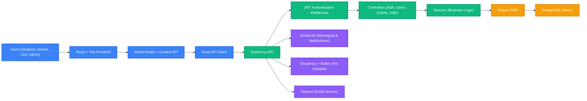
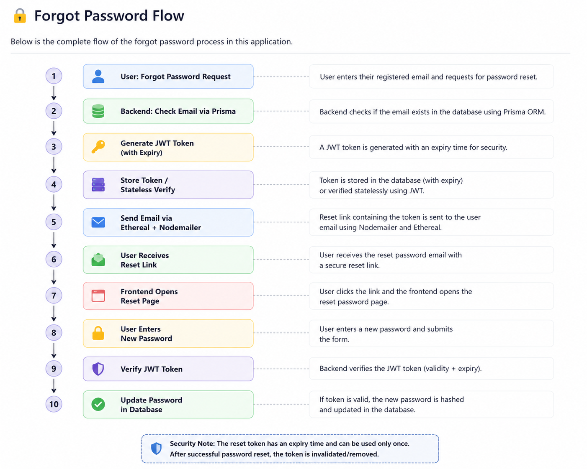
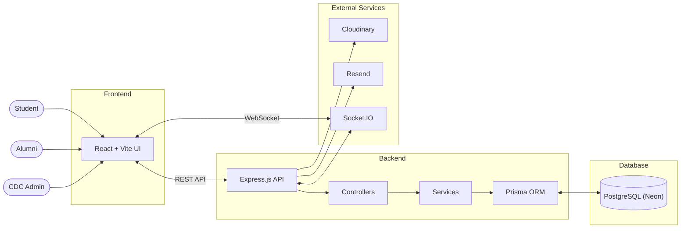
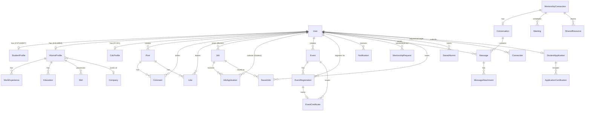
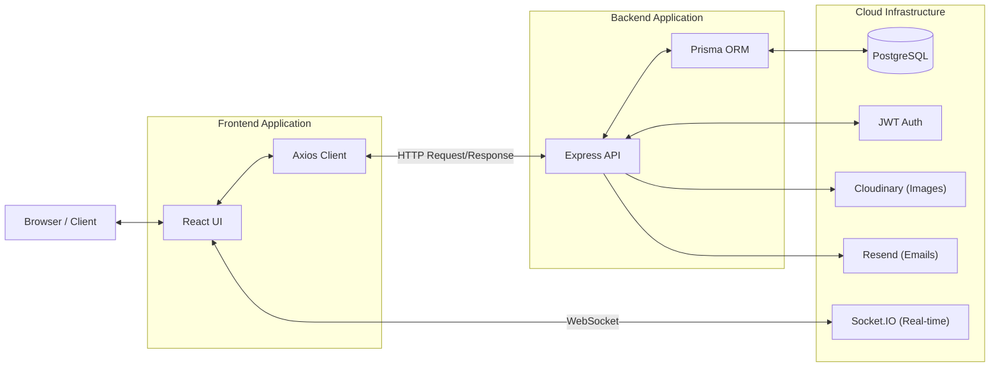
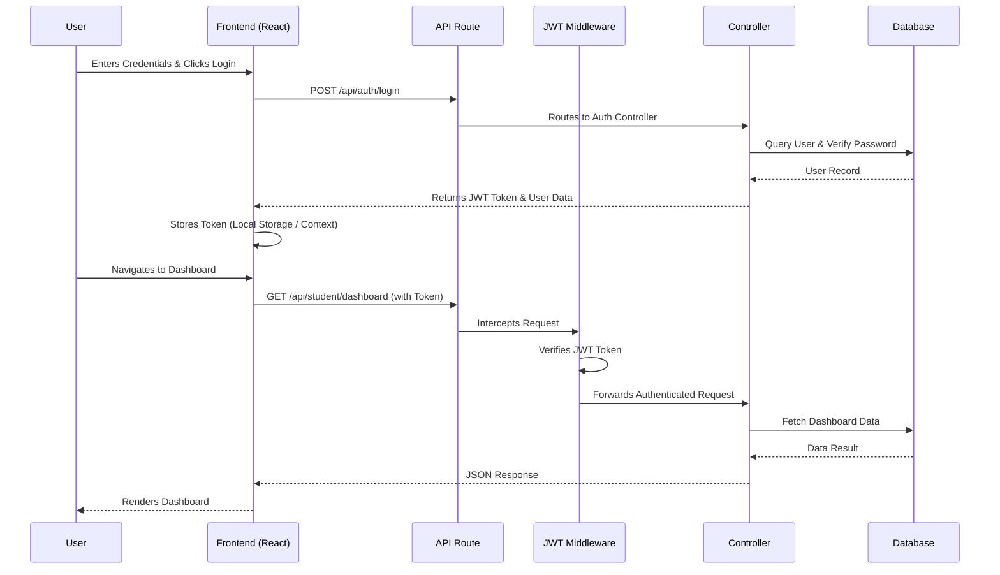
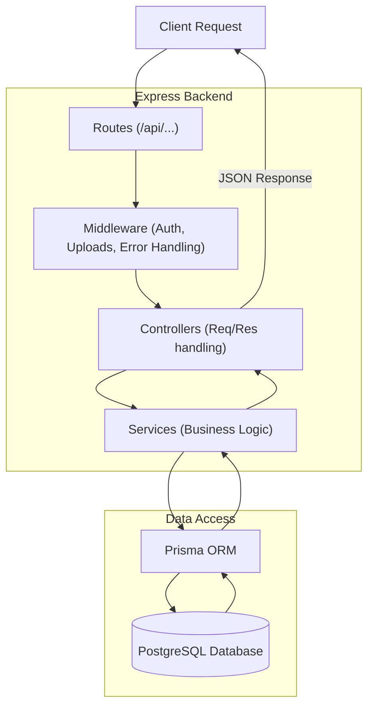
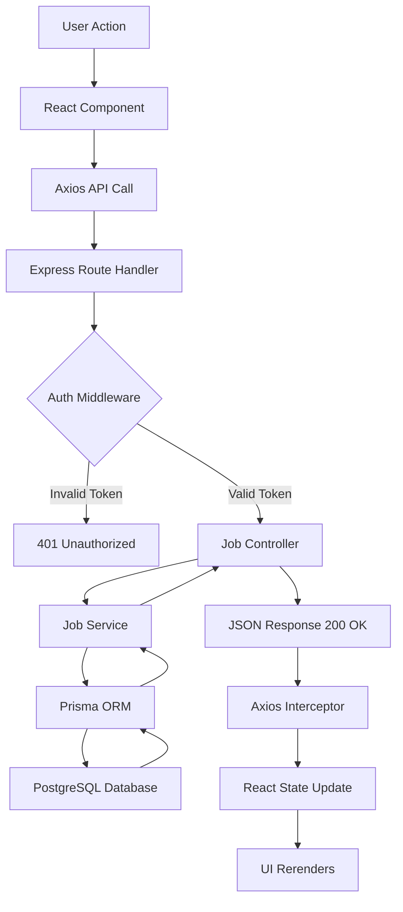
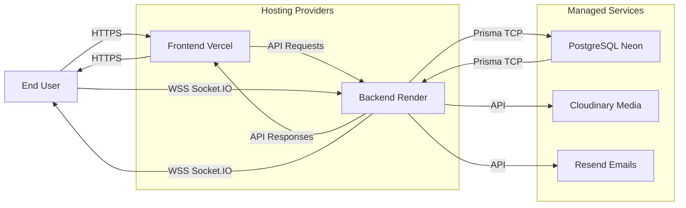
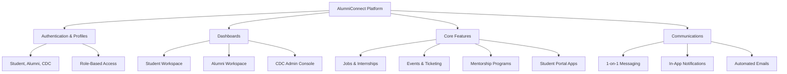

# AlumniConnect

> A role-based college networking platform for students, alumni, and the Career Development Cell (CDC).


## Overview

AlumniConnect brings students, alumni, and CDC together in one workspace for mentorship, jobs, events, announcements, and messaging.

### What the platform supports

- Student and alumni authentication
- CDC login-only access
- Student, alumni, and CDC dashboards
- Job browsing, bookmarking, applications, and moderation
- Event creation, registration, attendance, and approvals
- Mentorship requests and one-to-one messaging
- Real-time online presence updates through Socket.IO
- File uploads with Cloudinary, plus a local fallback
- Optional email verification and password reset flows

## 🚀 At a Glance (Updated with Testing)

| Area | Details |
|------|--------|
| Frontend | React 19, TypeScript, Vite, Tailwind CSS v4 |
| Backend | Express 5, Prisma, PostgreSQL, Forgot Password (JWT + Nodemailer (Ethereal)) |
| Realtime | Socket.IO |
| Forms | React Hook Form + Zod |
| HTTP | Axios |
| File Uploads | Cloudinary or local `uploads/` fallback |
| Dev Ports | Frontend: 5173, Backend: 5002 |
| Frontend Testing | Vitest, React Testing Library (RTL), @testing-library/user-event |
| Backend Testing | Jest, Supertest |
| E2E Testing | Cypress |
| API Mocking | MSW (Mock Service Worker), `vi.fn` (Vitest mocks) |

## Architecture


### 0. Architecture


### Full Forgot Password Flow


```

### 1. System Architecture

*High-level system overview showing how user interactions flow through the frontend to the backend, interact with the database via Prisma ORM, and utilize external services like Cloudinary for file uploads and Resend for emails.*

### 2. Database Architecture (ER Diagram)

*Entity-Relationship Diagram representing the PostgreSQL database schema. The `User` model acts as the central hub, utilizing a Role-Based Access Control (RBAC) model to link to specific `Student`, `Alumni`, or `CDC` profiles. It also illustrates relationships between posts, jobs, events, and mentorship connections.*

### 3. Client–Server Architecture

*Flow of data between the client (Browser/React) and the server (Express.js). Axios is used for HTTP requests, while Socket.IO handles real-time bidirectional communication. The Express backend integrates with external APIs and PostgreSQL.*

### 4. Authentication Flow

*Step-by-step authentication sequence. Users authenticate via an Express controller, receive a JSON Web Token (JWT), and use it for subsequent protected API requests, which are validated by a JWT middleware.*

### 5. MVC Architecture

*The backend follows a customized Model-View-Controller (MVC) pattern, split into Routes, Middleware, Controllers, and Services. The Service layer isolates business logic, making Controllers lighter and the codebase more testable.*

### 6. Request Lifecycle

*Lifecycle of a single API request, from the user clicking a button in the React UI, through the Axios network layer, backend middleware, controllers, services, database querying, and finally updating the frontend state.*

### 7. Deployment Architecture

*Typical production deployment architecture. The frontend is built and served globally via a CDN like Vercel, while the backend API runs on a PaaS like Render or Railway. Database and media storage are delegated to specialized managed services.*

### 8. Feature Architecture

*Modular breakdown of platform features. Functionalities are grouped into logically separate domains like Authentication, Dashboards, Core Features, and Communications, ensuring a scalable and maintainable codebase.*

## Role-Based Features

### Student

- Register and log in
- Build and update a profile
- Browse alumni and request mentorship
- Apply for jobs and internships
- Register for events
- View event certificates
- Chat with mentors and peers
- Review announcements in the dashboard

### Alumni

- Register and log in
- Manage profile and availability
- Create and edit events
- Post jobs and internships
- Review applicants and update candidate status
- Accept or reject mentorship requests
- Chat with students

### CDC

- Login only, no signup
- Review student applications
- Approve or reject alumni events
- Approve or reject alumni jobs
- Create official CDC events
- Export event registrants as CSV

## UI Notes

> Saved jobs are not a separate student page.
>
> Notifications are not a separate student page.
>
> Saved jobs are handled inside the Jobs view, and notifications appear in the top bar and dashboard announcements area.

## Core Screens

| Screen | Purpose |
| --- | --- |
| `/auth` | Role selection |
| `/auth/student/login` | Student login |
| `/auth/student/signup` | Student registration |
| `/auth/alumni/login` | Alumni login |
| `/auth/alumni/signup` | Alumni registration |
| `/auth/cdc/login` | CDC login |
| `/student/dashboard` | Student workspace |
| `/alumni/dashboard` | Alumni workspace |
| `/cdc/dashboard` | CDC console |

## API Surface

### Auth

- `POST /api/auth/student/signup`
- `POST /api/auth/alumni/signup`
- `POST /api/auth/student/login`
- `POST /api/auth/alumni/login`
- `POST /api/auth/cdc/login`

### Student

- `GET /api/student/profile`
- `GET /api/student/dashboard`
- `PUT /api/student/profile`

### Jobs

- `GET /api/jobs`
- `GET /api/jobs/:id`
- `POST /api/jobs/create`
- `PUT /api/jobs/:id`
- `POST /api/jobs/:id/apply`
- `POST /api/jobs/:id/save`

### Events

- `GET /api/events`
- `GET /api/events/admin/all`
- `GET /api/events/my-registrations`
- `GET /api/events/my-certificates`
- `POST /api/events/create`
- `POST /api/events/:id/register`
- `POST /api/events/:id/mark-attendance`
- `POST /api/events/:id/approve`
- `POST /api/events/:id/reject`

### Mentorship and Messages

- `GET /api/mentorship/dashboard`
- `POST /api/mentorship/request`
- `PATCH /api/mentorship/accept`
- `PATCH /api/mentorship/reject`
- `GET /api/messages`
- `POST /api/messages/send`

## Tech Stack

### Frontend

- React 19
- TypeScript
- Vite
- Tailwind CSS v4
- Framer Motion
- React Router DOM
- React Query
- React Hook Form
- Zod
- Socket.IO client

### Backend

- Node.js
- Express 5
- TypeScript
- Prisma ORM
- PostgreSQL
- JWT auth
- bcryptjs
- Socket.IO
- multer

### Services

- Neon PostgreSQL
- Cloudinary
- Resend

## Local Setup

### 1. Clone the repository

```bash
git clone <repository-url>
cd alumniconnect
```

### 2. Install dependencies

```bash
cd backend
npm install

cd ../frontend
npm install
```

### 3. Configure the backend

Create `backend/.env`:

```env
DATABASE_URL=your_postgres_connection_string
PORT=5002
FRONTEND_URL=http://localhost:5173

JWT_SECRET=your_jwt_secret
JWT_EXPIRES_IN=7d

EMAIL_VERIFY_SECRET=your_email_verify_secret
PASSWORD_RESET_SECRET=your_password_reset_secret

RESEND_API_KEY=your_resend_api_key
RESEND_FROM_EMAIL=no-reply@alumniconnect.com

CLOUDINARY_CLOUD_NAME=your_cloud_name
CLOUDINARY_API_KEY=your_api_key
CLOUDINARY_API_SECRET=your_api_secret

BACKEND_URL=http://localhost:5002
```

Notes:

- `RESEND_API_KEY` is optional for local development. If it is missing, email sending is skipped.
- `CLOUDINARY_*` is optional. If it is missing, file uploads use the local `uploads/` folder.
- If you change the backend port, update the frontend env and restart Vite.

### 4. Configure the frontend

Create `frontend/.env`:

```env
VITE_API_BASE_URL=http://localhost:5002/api
```

### 5. Run the app

Backend:

```bash
cd backend
npm run dev
```

Frontend:

```bash
cd frontend
npm run dev
```

### 6. Optional Prisma commands

```bash
cd backend
npx prisma generate
npx prisma migrate dev
npx prisma studio
```

### 7. Build and preview

Frontend build:

```bash
cd frontend
npm run build
```

Frontend preview:

```bash
cd frontend
npm run preview
```


Backend production run:

```bash
cd backend
npm run build
npm start
```

### 8 - Testing commands

## 🧪 Testing Guide

This project uses different testing tools for frontend, backend, and end-to-end testing.

### 🚀 1. Frontend Testing (Vitest + React Testing Library)

📍 Run inside frontend folder

- cd frontend
- npx vitest

🔁 Watch Mode (auto re-run tests)

- npx vitest --watch

### 🧪 2. End-to-End Testing (Cypress)

📍 Run inside frontend folder

📦 Install Cypress (first time only)

- npm install -D cypress

🖥️ Open Cypress UI (interactive mode)

- npx cypress open

⚙️ Headless mode (CI / terminal run)

- npx cypress run

### 🧪 3. Backend Testing (Jest + Supertest)

📍 Run inside backend folder

- cd backend

- npm test

- Alternative command:

- npx jest


### ⚡ 4. One-Line Full Testing Flow

Step 1: Backend tests

- cd backend && npm test

Step 2: Frontend unit tests

- cd frontend && npx vitest

Step 3: End-to-End tests

- cd frontend && npx cypress open

### 🔥 Final Tip

👉 You only need to remember these 3 commands:

- cd backend && npm test
- cd frontend && npx vitest
- cd frontend && npx cypress open

## 🧪 Testing Commands (Important)

| Tool                | Folder     | Command                  | Purpose                          |
|---------------------|------------|--------------------------|----------------------------------|
| Jest + Supertest    | backend    | npm test                 | Backend API Testing              |
| Vitest + RTL        | frontend   | npx vitest               | Frontend Component Testing       |
| Cypress (E2E)       | frontend   | npx cypress open         | End-to-End User Flow Testing     |
|Perfomance testing   | backend    | k6 run tests/loadtest.js |Performanc Testing                |  

## Useful Commands

| Task | Command |
| --- | --- |
| Start backend dev server | `cd backend && npm run dev` |
| Start frontend dev server | `cd frontend && npm run dev` |
| Build frontend | `cd frontend && npm run build` |
| Run frontend preview | `cd frontend && npm run preview` |
| Generate Prisma client | `cd backend && npx prisma generate` |
| Open Prisma Studio | `cd backend && npx prisma studio` |

## Folder Architecture

```text
alumniconnect/
├── frontend/                 # React + Vite application
│   ├── src/
│   │   ├── assets/           # Static files (images, icons)
│   │   ├── components/       # Reusable UI components (Buttons, Cards, Modals)
│   │   ├── hooks/            # Custom React hooks
│   │   ├── pages/            # Page-level components (Dashboards, Auth screens)
│   │   ├── routes/           # Routing configuration (React Router)
│   │   ├── services/         # API integration and Axios configuration
│   │   ├── types/            # TypeScript interfaces and types
│   │   └── utils/            # Helper functions
│   ├── index.css             # Tailwind CSS entry
│   └── package.json
│
└── backend/                  # Express.js + Node.js server
    ├── prisma/
    │   └── schema.prisma     # Database schema and models
    ├── src/
    │   ├── config/           # Environment variables and configuration
    │   ├── controllers/      # Request handlers (Auth, Events, Jobs)
    │   ├── lib/              # External service configurations (Cloudinary, Resend)
    │   ├── middleware/       # Custom middleware (JWT auth, error handler)
    │   ├── routes/           # API route definitions
    │   ├── services/         # Core business logic
    │   ├── types/            # TypeScript interfaces
    │   ├── utils/            # Shared utilities
    │   ├── validators/       # Zod validation schemas
    │   ├── server.ts         # Express app entry point
    │   └── socket.ts         # Socket.IO configuration
    └── package.json
```
*Directory structure of the monorepo, separating the React frontend and the Express backend while maintaining clean modularity within both.*

## Development Notes

- Backend health check: `GET /health`
- CDC accounts are login-only
- The active student dashboard is the role-based dashboard in `frontend/src/pages/student/StudentDashboard.tsx`
- Saved and Notifications are not separate student pages
- The backend is currently configured to run on port `5002`

